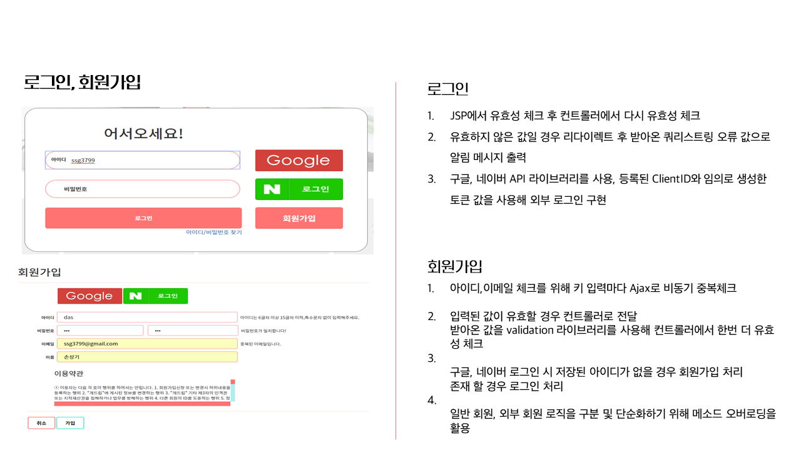
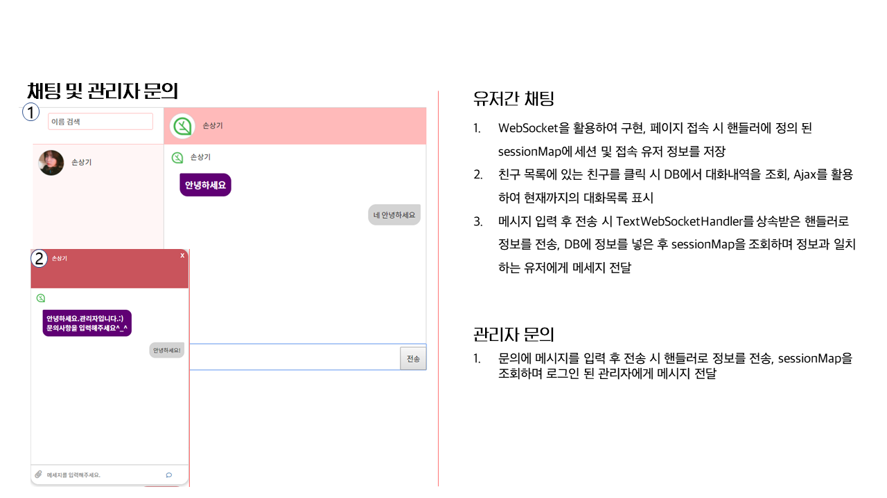
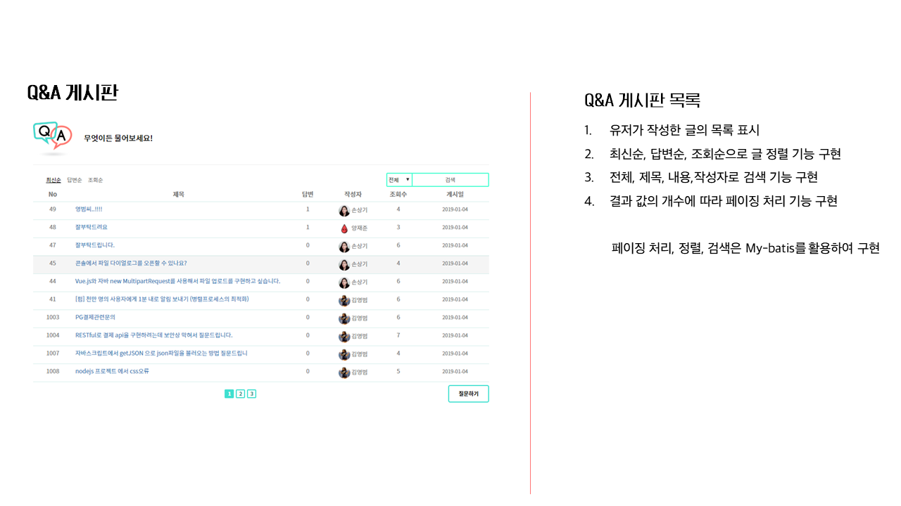
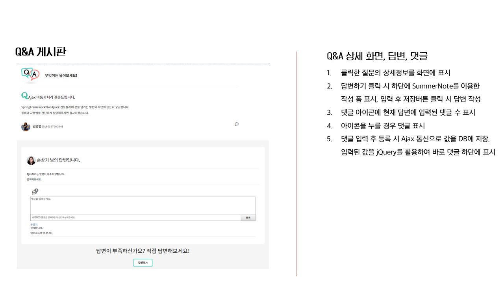
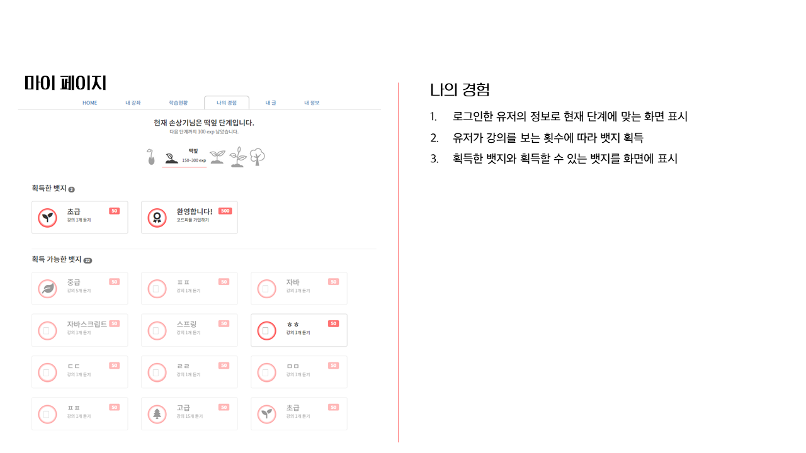
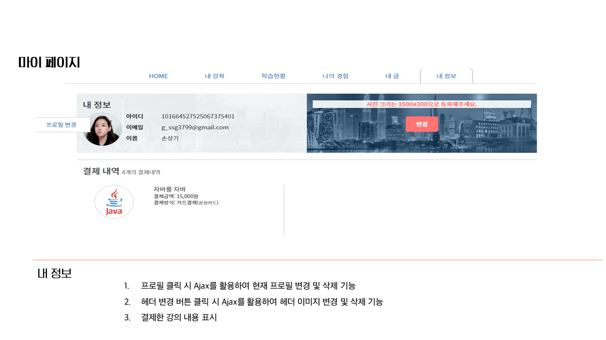
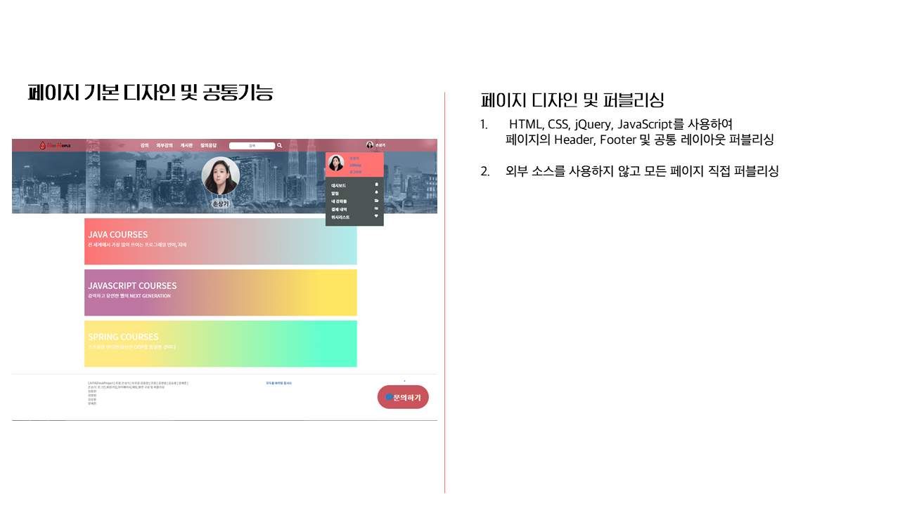

### 맡은 업무
* 로그인 및 회원가입
* Q&A 게시판, 공지사항 게시판
* 마이페이지
* 채팅 및 알림 등 웹소켓 관련
* 메인페이지
* 프로젝트 설계 및 초기 설정
* 페이지 디자인

### 맡은 부분 경로
##### Controller
###### src/main/java/com/jhta/cope/controller/
+ LoginController.java
+ QnaController.java
+ UserController.java

##### Service
###### src/main/java/com/jhta/cope/service/
+ QnaServiceImpl.java
+ UserServiceImpl.java
+ ChatServiceImpl.java

##### SQL
###### src/main/resources/META-INF/mybatis/mappers/
+ user.xml
+ qna.xml
+ chat.xml

#####기타
###### codepeople/src/main/java/com/jhta/cope/interceptor/
###### codepeople/src/main/java/com/jhta/cope/handler/
###### codepeople/src/main/resources/META-INF/spring/
+ 설정 파일들
######
